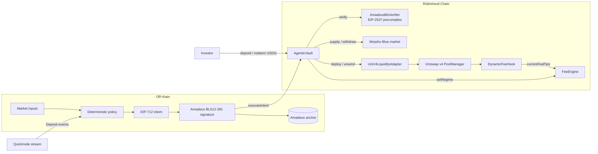

# Agentic Yield Vaults

**An AI-managed, institutional-grade USDG vault on Robinhood Chain. Every rebalance is signed by an Amadeus agent and verified on-chain.**

Investors deposit **USDG**. An agent with an **Amadeus Protocol** identity reads the market and moves the capital between two places:
- **Uniswap v4 liquidity** in a Stock Token/USDG pool. A **dynamic-fee hook** makes arbitrageurs pay for the adverse selection they cause.
- **Morpho Blue** lending, as a safe harbour.

The vault is written in **Rust for Arbitrum Stylus**. It only moves funds when the agent's **BLS12-381** signature checks out on-chain (EIP-2537 precompiles) and the allocation stays inside hard guardrails.

> Built for the Arbitrum Open House Singapore Online Buildathon (Robinhood Chain track).

---

## Why

- **Tokenized equities trade 24/7, but AMM liquidity providers get picked off.** Loss-versus-rebalancing (LVR) means that in many pools, arbitrageurs extract more than LPs earn in fees ([Milionis et al., 2022](https://arxiv.org/abs/2208.06046); [Fritsch & Canidio, 2024](https://arxiv.org/abs/2404.05803)).
- **Idle dollars earn nothing.** Institutions holding USDG want yield without a discretionary manager they cannot audit.
- **AI agents managing money are a black box.** You usually cannot verify who decided what, from which inputs, or whether the contract really checked it.

## What it does

| Market regime (decided by the agent) | Vault allocation | Uniswap v4 hook fee |
|---|---|---|
| **RISK_ON**: calm market | 50% Morpho · 50% rhNVDA/USDG LP | base 0.30% |
| **VOLATILE**: earnings within 2 days, implied vol > 60% | 70% Morpho · 30% LP | 0.30% + 2 pips per bps of vol (capped) |
| **RISK_OFF**: recession signal or crash momentum | 100% Morpho · 0% LP | max 5.00% |

Every decision is a pure function of its market inputs, so it is deterministic and replayable. The decision becomes an EIP-712 `RebalanceIntent` that carries an `inputsHash` and a `modelVersion`. The agent signs it with its Amadeus key and also anchors it on Amadeus as an audit log.



## Guarantees enforced on-chain

1. **No signature, no movement.** Funds only move through `executeIntent`, with a valid signature, the exact next nonce, a live deadline, and an EIP-712 domain bound to this vault and this chain.
2. **Whitelisted destinations only:** the configured v4 adapter and the configured Morpho market.
3. **Guardrails:**
   - LP leg capped at 70%; no LP at all in `RISK_OFF`.
   - Minimum interval between rebalances.
   - Maximum NAV loss per rebalance.
   - Pool price must stay within 10% of the oracle before any LP action (anti-manipulation).
4. **Guardian controls.** A guardian can pause the vault and run `emergencyExit`, which unwinds everything to idle USDG.
5. **Exits never depend on the agent.** Redemptions work while the vault is paused or the agent is offline (idle → Morpho → LP).

## What is real and what is simulated

| Real | Simulated (testnet MVP) |
|---|---|
| BLS12-381 verification of the Amadeus signature on Robinhood Chain (EIP-2537) | Market data: three curated, deterministic scenarios (calm, earnings week, recession) |
| Uniswap v4 PoolManager (Robinhood's), salt-mined dynamic-fee hook, real swaps and LP | rhNVDA Stock Token and its price oracle: Robinhood testnet has no official NVDA or Chainlink stock feeds |
| Morpho Blue (canonical bytecode, self-deployed: no official testnet deployment) with real borrowers and interest | Test USDG with a capped faucet; official USDG exists on testnet but is not obtainable at demo scale |
| Amadeus key derivation and signing (same library and scheme as `@amadeus-protocol/sdk`) | TEE execution and Amadeus uPoW inference: roadmap, not shipped |

### Stylus status (please read)

On **2026-10-02** new Stylus program activations were paused network-wide ([Security Council emergency action](https://forum.arbitrum.foundation/t/security-council-emergency-action-2-10-2026/31530)). `cargo stylus check` reports the pause on Robinhood testnet, Robinhood mainnet and Arbitrum Sepolia.

So:
- **The Rust/Stylus contracts in `contracts/stylus/` are the canonical implementation.** They are fully unit-tested and run end-to-end on a local Nitro devnode.
- **`contracts/evm/src/solidity-build/` is an ABI-identical Solidity build** with the same functions, events, errors and math. It is what runs live on Robinhood testnet until activations resume.
- The agent and the dashboard pick a build by address only. EIP-712 and BLS parity are enforced by shared test vectors.

## Repository

| Path | Contents |
|---|---|
| `contracts/stylus/` | Rust (stylus-sdk 0.10.10): `vault`, `fee-engine`, `bls-verifier`, `ecdsa-verifier` |
| `contracts/evm/` | Foundry: `DynamicFeeHook`, `UniV4LiquidityAdapter`, Solidity build, testnet mocks, `script/DeployAll.s.sol` |
| `agent/` | TypeScript agent: policy, intents, Amadeus BLS signer, relayer, Amadeus anchor, Fastify API + SSE |
| `frontend/` | Next.js 16 dashboard (wagmi 3/viem): NAV, regime, live allocation, signed-intent feed, deposit/redeem |
| `deployments/` | Public addresses per network |

## Deployments: Robinhood Chain testnet (46630)

Explorer: https://explorer.testnet.chain.robinhood.com. Full list in [`deployments/robinhood-testnet.json`](deployments/robinhood-testnet.json).

| Contract | Address |
|---|---|
| AgenticVault (Solidity build) | _filled by `scripts/deploy-testnet.sh`_ |
| AmadeusBlsVerifier | |
| FeeEngine | |
| DynamicFeeHook | |
| UniV4LiquidityAdapter | |
| Morpho Blue | |
| Uniswap v4 PoolManager | `0x8366a39CC670B4001A1121B8F6A443A643e40951` |

## Run it

```bash
# 0. keys -> .env (prints only public addresses to fund at the faucet)
cd agent && pnpm install && pnpm keys:new && pnpm tsx scripts/agent-identity.ts

# 1. deploy the full stack (mocks, Morpho, hook + pool, verifiers, vault, adapter)
./scripts/deploy-testnet.sh            # writes deployments/robinhood-testnet.json

# 2. agent (API on :8787)
cd agent && pnpm start

# 3. dashboard
node scripts/sync-frontend-env.mjs robinhood-testnet https://<agent-host>
cd frontend && pnpm install && pnpm dev

# 4. scripted demo: deposit -> RISK_ON -> VOLATILE -> RISK_OFF -> redeem
cd agent && pnpm tsx scripts/e2e-demo.ts robinhood-testnet
```

**No testnet ETH? Rehearse on a fork.** `INVESTOR_ADDRESS=0xYourWallet ./scripts/local-demo.sh` forks Robinhood testnet locally (its real v4 PoolManager and EIP-2537 precompiles). It deploys with the same script, starts the agent and serves the dashboard at http://localhost:3000. Add a MetaMask network with RPC `http://127.0.0.1:8545` and chain id 46630. Stop it with `./scripts/local-demo.sh stop`.

**Hosted demo on a fork (no testnet ETH needed).** On a VPS prepared with `bootstrap-vps.sh <IP>.sslip.io`, run `FORK_URL=<archive RPC> VERCEL_URL=https://<app>.vercel.app AGENT_PUBLIC_URL=https://<IP>.sslip.io ./scripts/vps-demo.sh`. It forks Robinhood testnet, deploys, and runs the agent under pm2. The agent also serves the fork at `POST /rpc`, method-filtered (`anvil_*`/`evm_*` are blocked). Paste the printed values into Vercel. With `AGENT_ORIGIN` set, the dashboard proxies `/agent/*` and `/rpc` to the VPS (`frontend/next.config.ts`), so the API and the wallet RPC are served from the Vercel domain.

**Production-style hosting.**
- **Agent:** runs on a VPS. `sudo -E bash scripts/bootstrap-vps.sh agent.example.com` installs Docker, Node, pnpm, pm2, Foundry, Rust + cargo-stylus and Caddy (HTTPS, SSE-safe proxy). Then run `pm2 start deploy/ecosystem.config.cjs`.
- **Dashboard:** deploys to Vercel with the root directory set to `frontend/`. Copy the `NEXT_PUBLIC_*` values from `frontend/.env.local`.

### Run the canonical Rust/Stylus build

Stylus activation works on a local Nitro devnode. `scripts/stylus-devnode.sh` (Linux with Docker) runs:
1. `DeployAll` phase `infra` (tokens, oracle, Morpho, a v4 PoolManager)
2. `cargo stylus deploy` of `fee-engine`, `bls-verifier` and `vault`
3. phase `pool` (hook, pool and adapter wired to the Rust vault)
4. the agent and the same E2E demo against the Rust vault

The phased orchestration passes the full E2E on a clean chain. `cargo stylus export-abi` confirms that the Rust vault exposes the same ABI as the Solidity build (`executeIntent`, `allocation`, `agentState`, `setAdapter`, …).

## Tests

| Suite | Command | Result |
|---|---|---|
| Rust/Stylus (share math, allocation planning, EIP-712 parity, BLS pipeline, access control) | `cargo test --workspace` | 54 passing |
| Solidity (full system with real v4 PoolManager + Morpho Blue, BLS verifier) | `forge test` | 24 passing |
| Agent (policy determinism, signers, engine, API auth/HMAC) | `pnpm -C agent test` | 30 passing |
| Dashboard formatters | `pnpm -C frontend exec vitest run` | 6 passing |
| End-to-end on a Robinhood testnet fork | `scripts/e2e-demo.ts` | 10/10 checks |

The BLS pipeline (hash-to-field off-chain, then `MAP_FP2_TO_G2` ×2 → `G2ADD` → `PAIRING_CHECK`) is also proven against the **live** Robinhood testnet precompiles by `agent/scripts/bls-vectors.ts`.

## Roadmap

- Switch the live vault to the Stylus build when activations resume.
- Live market data: Chainlink stock feeds, implied volatility, macro.
- Agent execution inside a TEE with remote attestation; multi-agent BLS aggregation.
- Mainnet: official USDG (`0x5fc5…d168`), Robinhood Stock Tokens, Morpho mainnet market; external audit before any real capital.

## License

MIT OR Apache-2.0 (Rust crates), MIT (Solidity and TypeScript).
